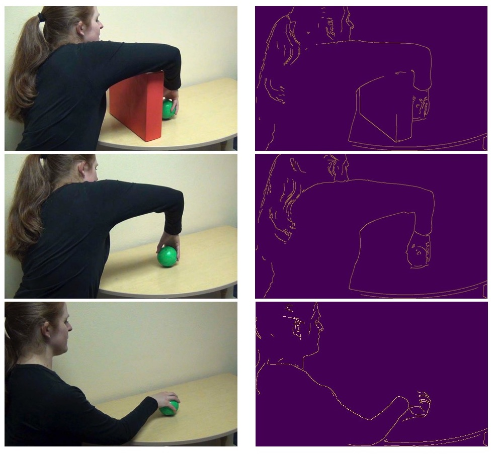

```{r setup, warning = FALSE}
library("papaja")
library(tidyverse)
library(lme4)
library(lmerTest)
library(here)
library(kableExtra)
library(knitr)
library(ggthemes)
library(dplyr)
library(viridis)

```

```{r analysis-preferences}
# Seed for random number generation
set.seed(42)
knitr::opts_chunk$set(cache.extra = knitr::rand_seed, echo = FALSE, warning = FALSE, message = FALSE, cache = FALSE)

# make sure summary() uses Type III sums of squares
afex::set_sum_contrasts()

# turn off scientific notation
options(scipen = 999)

# set plot theme
theme_set(theme_bw() + 
            theme(strip.background = element_blank(), 
                  panel.grid = element_blank())) # nice theme with limited extras
```

```{r load data}
participants <- read_csv(here("data/participant_data.csv"))
kg_data <- read_csv(here("data/cleaned_dt_data.csv"))
seg_judgments <- read_csv(here("data/seg_judgment_data.csv"))

```
Our everyday experience of the world centers on a sense of discrete events that occur across time. For example, we might experience a simple trip to the grocery store as a series of events that include parking the car, entering the store, putting groceries into a cart, paying the cashier, navigating a crowded parking lot, and loading up the trunk. Interestingly, the activity actually underlying this experience of events tends to be complex, dynamic, and evanescent. How do we transform the continuous, multi-modal stream that actually occurs into the experience of an event sequence? Answering this question has proven to be surprisingly challenging [@baldwin_baird_1999; @baldwin_baird_2001; @kurby_zacks_2008; @newtson_1977; @zacks_2007; @zacks_tversky_2001]. Even more challenging is to explain how infants and young children come to acquire adult-like skill at rendering continuously flowing experience in terms of event sequences. One challenge that has slowed progress on these issues is methodological: a dearth of available techniques for examining children's processing as information unfolds across time. In this paper, we showcase a valuable new method for this purpose, and report novel information about the nature of event-processing skill in preschool-aged children. 

Recent research reveals information about how event-segmentation skills begin to emerge in children’s development [see @levine_2019 for a review]. For example, infants as young as six months appear to be sensitive to the segmental structure of at least some kinds of activity streams [@baldwin_2001; @hespos_2009; @pace_2020; @stahl_2014], and infants’ sensitivity to event units within continuously flowing activity predicts their event memory [@sonne_2016; @sonne_2017].

Among the unanswered questions, however, is the degree to which early event segmentation rides on knowledge of goal structure. On the one hand, a large literature provides extensive evidence that children, like adults, are sensitive to goal structure and often seem to prioritize it in their interpretation of events [e.g., @falckytter_2006; @gergely_csibra_2003; @lakusta_landau_2005; @meltzoff_1995; @olofson_baldwin_2011; @phillips_2002; @woodward_1998]. However, much less information exists about how preschoolers' _online_ analysis of events (i.e., as activity unfolds over time) is influenced by knowledge of goal structure.

The methods used to investigate children’s sensitivity to goal structure typically involve first exposing children to events and, at subsequent test, inferring the extent to which they show sensitivity to the actor’s underlying goals. Additionally, traditional methods typically do not offer tight control for the impact of lower-level changes in motion that might influence children’s event processing. What seems like sensitivity to goal structure may actually reflect a response to lower-level changes in motion parameters that, for various reasons, happen to correspond to the completion of goals. In fact, previous research with adults [i.e., @hard_2011], reveals that motion change influences participants' online analysis of events, though it is not the sole predictor. If children's representations of actions' goal structure tend to be less robust than adults', they may rely even more on lower-level motion parameters to guide event processing. To our knowledge, there have been only limited attempts to disentangle the influence of surface-level motion characteristics from preschoolers’ sensitivity to higher-level goals as they process unfolding activity. To do so requires both quantification of changes in motion throughout dynamic activity as well as a method that indexes children’s processing of continuously streaming activity as it proceeds.

Hard and colleagues' [-@hard_2011] dwell-time paradigm is just such a technique, and it has previously been successfully employed a handful of times with preschool-aged children [e.g., @meyer_2011; @ross_baldwin_2015]. In the dwell-time task, slideshows are constructed by extracting still frames at regular intervals (e.g., one frame-per-second; fps) from videos of unfolding activity. Observers click a computer mouse to advance at their own pace through slideshows. Latency between mouse clicks (i.e., “dwell times”) indexes moment-to-moment changes in attention as activity unfolds. A 1fps rate of extraction necessarily results in less information than streaming video format (in which individual frames are also presented, but at a denser rate, frequently 30 frames per second). However, children process these slideshows similarly to videos of the same activity [@sage_baldwin_2015], presumably because the dwell-time-paradigm enables viewers to move quickly enough through slides to gain a sense of apparent motion.

Attentional profiles as revealed by dwell times tend to display a "boundary advantage" evidenced by surges of attention at event boundaries [@hard_2011; @kosie_baldwin_2019a; @kosie_baldwin_2019b]. These findings reveal that, as sensory information unfolds across time, adult observers typically modulate attention in a manner that reflects their segmental analysis of the dynamic activity stream.

Recent research begins to clarify mechanisms underlying the tendency to selectively focus attention on segment boundaries within dynamic activity. Segment boundaries represent information-rich regions for sampling event content: as one event unit ends, what will happen next is suddenly uncertain. Tuning the attentional system to pro-actively sample at these regions thus enhances efficient detection of informative content and facilitates event comprehension [@baldwin_kosie_2020; @shin_dubrow_2020; @zacks_2011]. At the same time, both adults and children respond reactively with enhanced attention when something novel or truly unexpected occurs as events unfold. For example, violations of causal or social expectations are well-known to elicit increased looking in infants [e.g., @cohen_salapatek_2013]; likewise, in adults, causal violations occurring in the midst of sleight-of-hand tricks induce momentary attentional surges [@sage_baldwin_2014]. Reactive attentional upticks of this kind - sometimes called "surprisal" responses - seem to reflect information-gathering in the face of the utterly unexpected.

It is worth noting that both the pro-active (e.g., boundary and hierarchical advantage) and reactive (e.g., violation of expectation) mechanisms just described likely arise from predictive knowledge; goal-structure knowledge is one form of such predictive knowledge [@baldwin_kosie_2020]. Goal-structure knowledge enables viewers to pro-actively anticipate segment boundaries and thus selectively sample richly informative boundary content as activity rapidly streams past. It also enables viewers to reactively upregulate sampling when events take an unexpected turn; that is, when surface motion does not unfold in accord with goal-related expectations. 

Some initial evidence indicates that children, like adults, display boundary advantages in dwell-time patterns measured for relatively familiar activity sequences [@meyer_2011; @ross_baldwin_2015] - suggesting that they, like adults, proactively sample information at goal-related segment boundaries. However, another study failed to find these key patterns in preschoolers' dwell times [@sage_baldwin_2015], engendering some uncertainty about the nature of preschoolers' event processing, and/or about the usefulness of the dwell-time paradigm for investigating children's event segmentation. The present research was thus also designed to provide additional information about the replicability of prior findings and the value of the dwell-time paradigm for this purpose. 

In the present research we specifically employed the dwell-time paradigm to examine the extent to which children's knowledge of goal structure influences their segmental analysis of an unfolding activity stream, relative to the influence of differential motion patterns. Although some prior research has drawn a distinction between where and how a given figure moves - that is, the path versus the manner of an event [e.g., @konishi_2016b; @konishi_2016a] - here we operationalize motion patterns as more generally encompassing both the path and manner of motion. We selected a type of event that even very young children are believed to understand with respect to goal structure; namely, the activity of reaching for, grasping, and retrieving a ball. In previous research, Phillips and Wellman [-@phillips_wellman_2005] employed this very event to examine 12-month-old infants' ability to recognize the overarching goal of object retrieval independent of the specific motion pattern used to effect that goal. Infants were habituated to an event in which an actor reached over a barrier to grasp and retrieve a ball. During subsequent test, infants displayed recovered interest when the actor used the identical motion pattern in a new context that appeared to violate canonical goal-oriented action (reaching over a non-existent barrier to grasp and retrieve the ball). In contrast, infants displayed continued habituation when the actor exhibited a novel motion pattern (reaching straight toward the ball) that preserved the canonical action properties with the same goal structure. Infants’ increase in attention to the violation of canonical goal-oriented action (e.g., arcing reach in the absence of a barrier) is often attributed to surprisal or violation of expectation, while infants’ continued habituation to the straight reach has been interpreted as confirming their sensitivity to an actor’s goal independent of the specific motions (e.g., arcing versus straight reach) produced to satisfy the goal. These looking-time patterns would seem to reflect reactive and proactive mechanisms of event processing, respectively. 

We employed this methodological design to investigate the relative degree to which goal-structure-related segment boundaries, surface motion properties, and goal-structure violations influence how preschoolers deploy their attention as activity unfolds across time. The logic of our analysis involved several steps. We first investigated the extent to which slide-to-slide pixel change varied across the three slideshows. Next, we tested whether slide type (boundary vs. non-boundary) or motion properties (i.e., pixel change) was the stronger predictor of dwell times. If children’s dwell times primarily pattern according to motion characteristics, pixel change should be the stronger predictor. However, if children’s dwell times are primarily shaped by their analysis of the goal-related segmental structure of an event, then slide type should be the stronger predictor. Longer dwelling on boundary versus non-boundary slides would reflect knowledge-based proactive sampling of boundary regions, and this is what we expected given previous evidence that infants prioritize goal structure in their analysis of unfolding activity. Finally, given that canonical properties of goal-oriented actions were violated for one of the three events (an arcing reach with no visible barrier), dwell-time patterns might differ for this event relative to the other two events. We hypothesized that the violation of expected motion characteristics might reactively elicit enhanced dwelling in the relevant portion of the violating event stream (when the arc over the non-existent barrier actually occurred) relative to the comparable region in the canonical event with the identical motion pattern (the arcing motion over the barrier).  

# Methods

```{r participant gender}
#number of participants of each gender
gender_ns <- participants %>% 
  count(gender) 

```
## Participants

Eighty-eight preschool-aged children (_M_ = `r round(mean(participants$age_months, na.rm = TRUE), 2)` months; range = 2.5 to 4.5 years; `r gender_ns$n[1]` female) were recruited to participate from a database of community members with children. Demographics reflected those of the surrounding community; participants were from primarily white and middle-class families. 

## Stimuli

Stimuli consisted of slideshows depicting an actor reaching for, and retrieving, a ball in three different ways [adapted from @phillips_wellman_2005]. In the _canonical-arc_ slideshow, the actor reached over a barrier, grasped the ball, lifted it back over the barrier, and set it on the table in front of her. The _non-canonical-arc_ slideshow depicted the actor using the same motion pattern displayed in the _canonical-arc_ slideshow, but in the absence of a barrier. In the _canonical-straight_ slideshow, there was again no barrier present. However, this time the actor reached straight for the ball, grasped it, and pulled it straight back before setting it down on the table in front of her. During filming, the actor used a metronome to ensure that reaches unfolded at the same rate across the three slideshows. Slideshows were created by extracting one still frame per second from these videos. Each slideshow contained 20 total slides, and participants viewed only one of the three slideshows. Data from the first and last slides were removed prior to analyses (e.g., @kosie_baldwin_2019a; @kosie_baldwin_2019b; @hard_2011; additional details are available in supplementary materials on the Open Science Framework (OSF) [Link: [osf.io/m6q7r](https://osf.io/m6q7r); @kosie_baldwin_OSF]).

```{r pb correlation, include = FALSE}
# calculate point biserial correlation

cor <- cor.test(seg_judgments$total, seg_judgments$st_numeric)

```
## Boundary Judgments
We classified each slide as a boundary or non-boundary. Three total boundary slides were identified per slideshow, corresponding to slides depicting initiation of the reaching action, grasping the ball, and setting the ball on the table. Because care was taken to temporally align the three reaching actions during filming (i.e., using the metronome), these boundaries occurred at the same slide number across the three slideshows. Boundary judgments were verified by a group of 37 na&iuml;ve raters. A point-biserial correlation indexing agreement [e.g. @zacks_2006a; @kurby_zacks_2011] was high (_r~pb~_(`r cor$parameter`) = `r cor$estimate`, $p `r papaja::printp(cor$p.value)`$, 95% CI[`r cor$conf.int[[1]]`, `r cor$conf.int[[2]]`]). Example slides are depicted in Figure 1. The three slideshows and additional details about boundary judgments are available on the [OSF](https://osf.io/m6q7r).

```{r fig1, fig.cap="Examples of boundary (outlined in red) and non-boundary slides from the three slideshows.", fig.align = "center"}

include_graphics("figures/slide_example.pdf")
```

## Motion Change
To gain an objective measure of motion-pattern differences across slideshows, we calculated pixel change as an index of slide-to-slide motion change in each of the three slideshows [following @hard_2011]. A Canny Edge Detector convolution filter [@canny_1986] identified and highlighted high contrast areas of each slide image, corresponding to the edges of people and objects (see Figure 2). We then calculated the degree of pixel change between adjacent convolution-filtered frames [@loucks_baldwin_2009; see OSF for details]. The resulting values indicated the average amount of pixel change between a given slide and the slide immediately preceding it. 

```{r fig2, fig.cap="Example slides from the three slideshows before and after being passed through a convolution filter.", fig.align = "center", out.width = "4in"}


```

## Procedure
The experiment consisted of a training task and then the main dwell-time task (see OSF for details). The goal of the training task (a slideshow depicting a train moving from right to left across the screen) was simply to acquaint children with the experience of clicking the mouse to advance slides in order to see an event unfold. After completing the training task, children clicked through one of the three slideshows. Slideshow was varied between subjects to (a) avoid carryover effects across the three reaching conditions and (b) reduce the duration of the experiment. After viewing the slideshow once, an image of a field and clouds was presented, and children then immediately clicked through the same slideshow a second time.

# Results
```{r pix change, include = FALSE}
# pixel change summary

# get only convolution-filtered pixel data from kg_data file  
pix <- kg_data %>% 
  filter(run == "first") %>% 
  dplyr::select(condition, slide_num_adj, slide_type, pix_adj) %>% 
  distinct()

# does pixel change differ across slide type and condition?
pix_aov <- summary(aov(pix_adj ~ slide_type * condition, data = pix))
pix_mod <- unlist(pix_aov)

# get means and sds for summary
pix_summary <- pix %>% 
  group_by(condition) %>% 
  summarise(mean = mean(pix_adj, na.rm = TRUE), 
            sd = sd(pix_adj, na.rm = TRUE))

b_v_s <- t.test(pix_adj ~ condition, data = filter(pix, condition != "nothing"))
n_v_s <- t.test(pix_adj ~ condition, data = filter(pix, condition != "barrier"))
b_v_n <- t.test(pix_adj ~ condition, data = filter(pix, condition != "straight"))

p.values <- c(b_v_s$p.value, n_v_s$p.value, b_v_n$p.value)
p.val.adj <- p.adjust(p.values, method = "bonferroni", n = length(p.values))

```
## Motion characteristics differed across the three slideshows.
We first investigated the extent to which pixel change values differed across slideshow versions. An analysis of variance, predicting pixel change from slideshow, condition, and their interaction, revealed that, as expected, overall average pixel change values differed across the _canonical-arc_ (_M_ =`r pix_summary$mean[1]`, _SD_ = `r pix_summary$sd[1]`), _non-canonical-arc_ (_M_ =  `r pix_summary$mean[2]`, _SD_ = `r pix_summary$sd[2]`), and _canonical-straight_ slideshows (_M_ =  `r pix_summary$mean[3]`, _SD_ = `r pix_summary$sd[3]`), $F(`r pix_mod[["Df2"]]`, `r pix_mod[["Df4"]]`) = `r pix_mod[["F value2"]]`$, $p`r papaja::printp(pix_mod["Pr(>F)2"])`$. This difference was primarily driven by reduced pixel change for the _canonical-straight_ slideshow relative to both the _canonical-arc_ and _non-canonical-arc_ slideshows (Bonferroni-corrected $ps `r papaja::printp(p.val.adj[2])`$) (see Figure 3). Average pixel change did not differ between the _canonical-arc_ and _non-canonical-arc_ slideshows ($p `r papaja::printp(p.val.adj[3])`$). The difference in pixel change for boundary versus non-boundary slides was not significant, $F(`r pix_mod[["Df1"]]`, `r pix_mod[["Df4"]]`) = `r pix_mod[["F value1"]]`$, $p = `r papaja::printp(pix_mod[["Pr(>F)1"]])`$, nor was there a significant interaction between slide type and condition, $F(`r pix_mod[["Df3"]]`, `r pix_mod[["Df4"]]`) = `r pix_mod[["F value3"]]`$, $p = `r papaja::printp(pix_mod[["Pr(>F)3"]])`$. Thus, if a boundary advantage in dwell times were to be observed in subsequent analyses, it would be unlikely that this effect could be solely explained by differences in motion change between boundary and non-boundary slides. 

```{r fig3, fig.cap="Degree of absolute pixel change across the three slideshows. Dashed lines indicate slides corresponding to event boundaries.", fig.align = "center", fig.width = 7}

# figure with different lines for the three conditions and a vertical line at boundaries
pix_plot <- pix %>% 
  mutate(condition = recode(condition, barrier = "Canonical-Arc",
                            nothing = "Non-Canonical-Arc", 
                            straight = "Canonical-Straight")) 

pix_plot$condition <- factor(pix_plot$condition, levels = c("Canonical-Arc", "Non-Canonical-Arc", "Canonical-Straight"))

ggplot(pix_plot, aes(x = slide_num_adj, y = pix_adj, color = condition)) +
  geom_line(size = 1) +
  labs(x = "Slide Number", y = "Pixel Change", color = "Slideshow") + 
  scale_color_viridis(discrete = TRUE, option = "D") +
  geom_vline(xintercept = c(2, 9, 17), size = .75, color = "black", linetype = "dashed")

```
```{r participant summary, include = FALSE}
condition_ns <- kg_data %>% 
  distinct(subid, .keep_all = TRUE) %>% 
  count(condition) 

ages <- kg_data %>% 
  select(subid, age_months, condition) %>% 
  distinct() %>% 
  group_by(condition) %>% 
  summarise(mean_mos = mean(age_months, na.rm = TRUE),
            mean_yrs = mean_mos/12)
```
```{r preliminary run analysis, include = FALSE}
run_mod <- lmer(logDT_win ~ run * condition + (run|subid), data = kg_data)
summary(run_mod)
anova(run_mod)

run_mod_coefs <- summary(run_mod)$coef
run_mod_aov <- unlist(anova(run_mod))

run_summary <- kg_data %>% 
  group_by(run) %>% 
  summarise(mean = mean(logDT_win, na.rm = TRUE),
            sd = sd(logDT_win, na.rm = TRUE))

```
## Preparing Dwell Time Data
As described previously, dwell times index the latency between mouse clicks, or the total amount of time a given slide was visible on the screen. We used standard methods to prepare dwell-time data for analyses [e.g., @kosie_baldwin_2019a; @kosie_baldwin_2019b], including log~10~ transforming dwell times and removing participants with excessively long dwell times. In the current study, three participants' data were excluded for this reason (two from the _canonical-straight_ condition and one from the _non-canonical-arc_ condition), leaving `r sum(condition_ns$n)` total participants ( _canonical-arc_: N = `r condition_ns$n[1]`, _M~age~_ =  `r ages$mean_yrs[1]` years; _non-canonical-arc_: N = `r condition_ns$n[2]`, _M~age~_ = `r ages$mean_yrs[2]` years; _canonical-straight_: N = `r condition_ns$n[3]`, _M~age~_ = `r ages$mean_yrs[3]` years). Overall average dwell times decreased from preschoolers' first (_M_ =  `r round(run_summary$mean[1], 2)`, _SD_ = `r round(run_summary$sd[1], 2)`) to second (_M_ =  `r round(run_summary$mean[2], 2)`, _SD_ = `r round(run_summary$sd[2], 2)`) viewing of the same slideshow, ($F(`r run_mod_aov[["NumDF1"]]`, `r run_mod_aov[["DenDF1"]]`) = `r run_mod_aov[["F value1"]]`$, $p = `r papaja::printp(run_mod_aov["Pr(>F)1"])`$). However, this effect did not reach statistical significance nor did it interact with slideshow ($F(`r run_mod_aov[["NumDF3"]]`, `r run_mod_aov[["DenDF3"]]`) = `r run_mod_aov[["F value3"]]`$, $p = `r papaja::printp(run_mod_aov["Pr(>F)3"])`$). Thus, dwell times were averaged across the two viewings. See [OSF](https://osf.io/m6q7r) for additional methodological details.

Linear mixed effects models were fit with type III sums of squares in the `lme4` package [@bates_2015] in R [@r]. The `lmerTest` package [@lmerTest] was used to assess statistical significance using Satterthwaite's approximation for degrees of freedom. 

```{r goal vs motion, include = FALSE}
#average across runs
df <- kg_data %>% 
  group_by(subid, slide_num_adj, condition, pix_adj, slide_type, age_months) %>% 
  summarise(dwell_time = mean(logDT_win, na.rm = TRUE),
            mean_milli = mean(milliDT, na.rm = TRUE))

#get summary statistics for boundary advantage
ba_stats <- df %>% 
  group_by(slide_type) %>% 
  summarise(mean = mean(dwell_time, na.rm = TRUE),
            sd = sd(dwell_time, na.rm = TRUE))

#dt_mod, now with pixel change
dt_pix_mod <- lmer(dwell_time ~ slide_type * scale(pix_adj, center = TRUE) + (slide_type|subid), data = df, REML = FALSE)
summary(dt_pix_mod)
dt_pix_coefs <- summary(dt_pix_mod)$coef

#dt_mod, now with pixel change and age
dt_pix_mod_age <- lmer(dwell_time ~ slide_type * scale(pix_adj, center = TRUE) * age_months + (slide_type|subid), data = df, REML = FALSE)
summary(dt_pix_mod_age)
dt_pix_age_coefs <- summary(dt_pix_mod_age)$coef

```

# Preschoolers prioritized goal-related segmental structure over motion characteristics.

We next explored the extent to which preschoolers’ dwell times reflected proactive anticipation of event boundaries (i.e., longer dwelling to boundary over non-boundary slides) versus slide-to-slide motion change. We ran a linear mixed effects model predicting dwell time from slide type (boundary vs. non-boundary), slide-to-slide pixel change (centered to reduce multicollinearity), and their interaction (all as fixed effects). This model included random intercepts for subjects and random slopes for slide type. If children’s dwell times primarily pattern according to motion characteristics, pixel change should be the stronger predictor of dwell times. However, if children’s dwell times are primarily shaped by their analysis of the goal-related segmental structure of an event, then slide type should be the stronger dwell-time predictor. 

Replicating several prior studies with preschoolers and adults [e.g., @meyer_2011; @hard_2011; @kosie_baldwin_2019a; @kosie_baldwin_2019b; @ross_baldwin_2015], dwell times were significantly higher to boundary (_M_ = `r round(ba_stats$mean[1], 2)`, _SD_ = `r round(ba_stats$sd[1], 2)`) over non-boundary slides (_M_ = `r round(ba_stats$mean[2], 2)`, _SD_ = `r round(ba_stats$sd[2], 2)`), $\beta=`r round(dt_pix_coefs["slide_type1","Estimate"], 2)`$ ($SE=`r round(dt_pix_coefs["slide_type1","Std. Error"], 2)`$), $p = `r papaja::printp(dt_pix_coefs["slide_type1","Pr(>|t|)"])`$. However, pixel change was not a significant predictor, $\beta=`r round(dt_pix_coefs["scale(pix_adj, center = TRUE)","Estimate"], 2)`$ ($SE=`r round(dt_pix_coefs["scale(pix_adj, center = TRUE)","Std. Error"], 2)`$), $p = `r papaja::printp(dt_pix_coefs["scale(pix_adj, center = TRUE)","Pr(>|t|)"])`$, nor did it interact with slide type, $\beta=`r round(dt_pix_coefs["slide_type1:scale(pix_adj, center = TRUE)","Estimate"], 2)`$ ($SE=`r round(dt_pix_coefs["slide_type1:scale(pix_adj, center = TRUE)","Std. Error"], 2)`$), $p = `r papaja::printp(dt_pix_coefs["slide_type1:scale(pix_adj, center = TRUE)","Pr(>|t|)"])`$. Visual inspection of slide-to-slide differences in pixel change (Figure 3) versus dwell time (Figure 4) supports the finding that dwell times did not in any direct way track pixel change. These results are consistent with the hypothesis that goal structure is a primary determinant of preschoolers’ segmental analysis of continuously unfolding dynamic activity, even when controlling for motion pattern differences. 

To test for possible age-related effects, we re-ran the above model, now including age in months and all interactions with age. Age did affect participants’ overall dwell times, with younger children dwelling longer on average than older children, $p = `r papaja::printp(dt_pix_age_coefs["age_months","Pr(>|t|)"])`$. However, participant age did not interact with any of the above-described effects nor did inclusion of age affect any of our conclusions (see [OSF](https://osf.io/m6q7r) for further details).

```{r fig4, fig.cap="Dwell times across the three slideshows. Dashed lines indicate slides corresponding to event boundaries. Shaded region represents one standard error.", fig.align = "center", fig.width = 7}

#center individual dwell times by condition and then average 
plot_data <- df %>% 
  group_by(condition, slide_num_adj) %>% 
  summarise(mean_dt = mean(dwell_time),
            sd_dt= sd(dwell_time, na.rm=TRUE),
            n = n(),
            se=sd_dt/sqrt(n),
            ci = qt(0.975,df=n-1)*se) %>% 
  left_join(pix) %>% 
  ungroup() %>% 
  mutate(condition = recode(condition, barrier = "Canonical-Arc",
                            nothing = "Non-Canonical-Arc", 
                            straight = "Canonical-Straight")) 

plot_data$condition <- factor(plot_data$condition, levels = c("Canonical-Arc", "Non-Canonical-Arc", "Canonical-Straight"))

ggplot(plot_data, aes(x = slide_num_adj, y = mean_dt, color = condition, fill = condition)) +
  geom_line(size = 1) +
  labs(x = "Slide Number", y = expression(paste("Average ", ~Log["10"], " Dwell Time")), color = "Slideshow") +  
  geom_ribbon(aes(ymin=mean_dt-se, ymax=mean_dt+se), alpha=0.25, colour = NA) +
  scale_color_viridis(discrete = TRUE, option = "D")+
  scale_fill_viridis(discrete = TRUE) +
  geom_vline(xintercept = c(2, 9, 17), size = .75, color = "black", linetype = "dashed") +
  guides(fill = FALSE)

```
```{r bump analysis, include = FALSE}
#get only slides 12 and 13 from barrier and nothing conditions
bump <- df %>% 
  filter(slide_num_adj >= 12 & slide_num_adj <=13 & condition != "straight") 

bump_summary <- bump %>% 
  group_by(condition) %>% 
  summarise(mean = mean(dwell_time, na.rm = TRUE),
            sd = sd(dwell_time, na.rm = TRUE))

bump_mod <- lmer(dwell_time ~ condition + (1|subid), data = bump)
summary(bump_mod)
anova(bump_mod)
bump_coefs <- summary(bump_mod)$coef

#plus pixel
bump_mod_pix <- lmer(dwell_time ~ condition * scale(pix_adj, center = TRUE) + (1|subid), data = bump)
summary(bump_mod_pix)
anova(bump_mod_pix)

#plus age
bump_mod_age <- lmer(dwell_time ~ condition * age_months + (1|subid), data = bump)
summary(bump_mod_age)
anova(bump_mod_age)
```

## Exploratory analyses revealed a marginal increase in attention to causal violations.

Visual inspection of Figure 4 revealed a surge in mean dwell time between slides 12 and 13 of the _non-canonical-arc_ slideshow that seemed to be absent in the other two slideshows. This region corresponds to the juncture in the _non-canonical-arc_ slideshow at which the actor uses an arcing reach - despite the absence of a barrier - to bring the ball back and place it on the table in front of her. If, as described earlier, preschoolers are sensitive to this violation of the canonical properties of goal-oriented action, this juncture might be where we would anticipate a corresponding _reactive_ violation - or novelty-related increase in dwell times [as in previous dwell-time studies with adults; @sage_baldwin_2014; @kosie_baldwin_2019a]. Thus, we next compared participants' dwell times within this region of causal violation (slides 12-13) across the two slideshows that were matched in motion trajectory but differed in that one violated canonical, goal-related motion ( _non-canonical-arc_) while the other did not ( _canonical-arc_). Because decisions regarding which slides to include in analyses were made _after_ viewing Figure 4, we conducted and interpreted these analyses in a purely exploratory manner. 

Numerically, mean dwell times were greater to the region of causal violation in the _non-canonical-arc_ slideshow (_M_ = `r round(bump_summary$mean[2], 2)`, _SD_ = `r round(bump_summary$sd[2], 2)`) than in the _canonical-arc_  (_M_ = `r round(bump_summary$mean[1], 2)`, _SD_ = `r round(bump_summary$sd[1], 2)`) slideshows. However, a linear mixed effects model (including a fixed effect of condition and random intercepts for subjects) did not reach statistical significance, $\beta=`r round(bump_coefs["condition1","Estimate"], 2)`$ ($SE=`r round(bump_coefs["condition1","Std. Error"], 2)`$), $p = `r papaja::printp(bump_coefs["condition1","Pr(>|t|)"])`$. As in the above analysis, these effects did not differ when adding pixel change as a covariate, nor did they interact with participant age. While the differences in means were suggestive that preschoolers may be sensitive to violations to canonical goal-oriented action, clear conclusions to this effect could not be drawn from the current results. Further, it seems possible that this violation was not difficult for preschoolers to resolve. If the violation had been more striking, it might have had a greater impact on participants’ dwell times.

# Discussion
Although prior research clarifies that young children often weight goal structure information more heavily than motion patterns in their interpretation and memory for human action, it was not known how these two sources of information influence children's segmental analysis as activity unfolds across time. To this effect, we harnessed the relatively new dwell-time paradigm to examine the extent to which children's knowledge of goal structure influenced their segmental analysis of unfolding behavior, relative to the influence of differential motion patterns. Preschoolers advanced at their own pace through activity sequences with the same goal-related segmental structure but varying in motion parameters. Across all three activity sequences, preschoolers' dwell times increased at the same goal-related event boundaries. These results - using three new activity sequences - replicate previous research, and confirm that preschoolers, like adults, attend to goal-related segmental structure as they process unfolding activity [@hard_2011; @kosie_baldwin_2019a; @kosie_baldwin_2019b; @hard_2018; @meyer_2011; @ross_baldwin_2015]. 

We also directly investigated the effect of slide-to-slide motion change on dwell times, a key test of the extent to which dwell times track goal structure versus motion patterns. Slide-to-slide pixel change did not predict preschoolers’ dwell times. Further, preschoolers’ tendency to dwell longer on goal-related event boundaries remained robust when slide-to-slide pixel change was independently controlled for. These findings make a strong case that knowledge of goal-structure powerfully, and pro-actively, informs preschoolers’ analysis of activity as it unfolds across time.

Finally, while we saw some indication that preschoolers reactively increased attention to a motion-related causal violation  [e.g., @phillips_wellman_2005; @sage_baldwin_2014]. However, this effect was weak and did not reach statistical significance. 

Altogether, these results provide substantial evidence that goal-related segmental structure, rather than the specifics of motion parameters underlying the activity stream, are a primary determinant of preschoolers' attentional patterns during event processing. An important topic for future research will include efforts to discover the degree to which event type, novelty, and complexity impact their tendency to prioritize goal-structure as streaming events are processed.

In addition to providing new insight into how preschoolers modulate their attention when viewing everyday action, this work validates the dwell-time paradigm as a useful methodology with which to explore preschoolers' processing of activity as it unfolds. The dwell-time paradigm is inexpensive, child-friendly, easy to use, and portable. Thus, in addition to the lab, this paradigm can be implemented in preschools, museums, and in the field. Finally, because the dwell-time paradigm is an implicit measure of processing - requiring only that participants click through an unfolding slideshow - it provides the opportunity to run exactly the same procedure across a broad age span and with children experiencing atypical developmental profiles. The dwell-time paradigm thus holds powerful potential to reveal nuanced information about (a) variability in children's event-processing tendencies, and (b) how children's processing becomes more adult-like over time.

In conclusion, we replicated previous findings that preschoolers, like adults, attend to goal-related segmental structure as dynamic activity unfolds, and extended these findings to demonstrate that preschoolers prioritize goal structure over motion properties in their segmental analysis of activity streams. Our findings showcase the value of the dwell-time paradigm as a useful methodology with which to investigate preschoolers' processing of dynamically unfolding visual information. These results set the stage for further investigation into factors that influence preschoolers' processing of events as their development and knowledge acquisition progress.

\newpage

# References
```{r create_r-references, include = FALSE}
r_refs(file = "r-references.bib")
```

\begingroup
\setlength{\parindent}{-0.5in}
\setlength{\leftskip}{0.5in}

<div id = "refs"></div>
\endgroup
